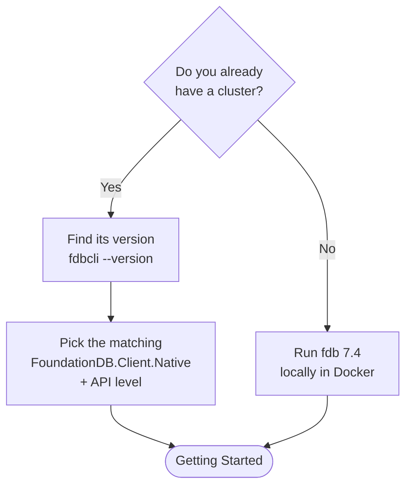

# Cluster setup

Before your app can read or write anything, it needs a cluster to talk to. Two situations:

- You already have a cluster (a colleague set one up, or it runs in your infrastructure): see [Connect to an existing cluster](#connect-to-an-existing-cluster).
- You have nothing yet: see [Run a local cluster with Docker](#run-a-local-cluster-with-docker).



## Connect to an existing cluster

### 1. Find the cluster version

The native client you ship must match the cluster (see [How it connects](foundationdb-101.md)), so first find the version:

```console
fdbcli --version
```

You should see something like:

```
FoundationDB CLI 7.3 (v7.3.70)
source version ...
protocol fdb00b073000000
```

The `7.3` (or `7.4`) is what matters. If `fdbcli` is not installed, ask whoever runs the cluster, or read the version from its `status` output.

### 2. Pick the matching packages

| Your cluster | `FoundationDB.Client.Native` | API level |
|---|---|---|
| `7.3.x` | a `7.3.x` version (e.g. `7.3.70`) | `730` |
| `7.4.x` | a `7.4.x` version (e.g. `7.4.6`) | `740` (or `730` to stay compatible with `7.3`) |

Keep `FoundationDB.Client` (the managed package) on the latest either way. Only the native package tracks the cluster version.

> Planning to move to `7.4` soon? Target API level `730` today against your `7.3` cluster, then switch the native package to `7.4.x` and raise the API level to `740` once the cluster is upgraded. The managed package and your code do not change.

### 3. Point your app at it

Your app needs the cluster's coordinators, given as either a **cluster file** (`fdb.cluster`, the same one `fdbcli` uses) or a **connection string** with the same contents. Both are one line, `description:id@host:port` (with more hosts for multi-coordinator clusters):

```
mycluster:abcdef1234567890@10.0.0.10:4500
```

You will use this in [Getting Started](getting-started.md). Prefer the NuGet native package over a machine-wide client install, so each project pins its own version (see [why](foundationdb-101.md#why-pin-the-native-client-per-project)).

## Run a local cluster with Docker

No cluster? Run a throwaway single-node **FoundationDB 7.4** in Docker. This works the same on Windows, Linux and macOS: `fdbserver` is a Linux program, so even on Windows and macOS it runs inside the Linux container, and your .NET app talks to it over the network.

Match your app to it: `FoundationDB.Client.Native` `7.4.x` and API level `740` (or `730`).

### 1. Start the container

```console
docker run --detach --name fdb \
  --publish 127.0.0.1:4500:4500 \
  --env FDB_NETWORKING_MODE=host \
  --env FDB_PORT=4500 \
  --env FDB_COORDINATOR_PORT=4500 \
  foundationdb/foundationdb:7.4.6
```

`FDB_NETWORKING_MODE=host` makes the server advertise `127.0.0.1` so your app on the host can reach it, and the matched `--publish 127.0.0.1:4500:4500` keeps the port identical inside and outside the container. Both matter: without them the client connects once, is handed an address it cannot reach, and every transaction times out.

- `Cannot connect to the Docker daemon`: Docker is not running (see [Prerequisites](prerequisites.md)).
- `The container name "/fdb" is already in use`: you already have one. Reuse it with `docker start fdb`, or remove it with `docker rm -f fdb` and re-run.
- On an Apple Silicon Mac, Docker may run the image under emulation if there is no native arm64 build (it works, just slower). If it refuses to start, add `--platform linux/amd64`.

### 2. Initialize the database (once)

A brand-new cluster has no database yet. Create one:

```console
docker exec fdb fdbcli --exec "configure new single ssd"
```

You should see:

```
Database created
```

`single` means one copy of the data (fine for local dev); `ssd` is the storage engine.

### 3. Check it is up

```console
docker exec fdb fdbcli --exec "status minimal"
```

You should see:

```
The database is available.
```

Right after `configure`, `status minimal` may briefly report "The database is available, but has issues" while the cluster finishes recruiting; wait a few seconds and it settles to "The database is available". If you see "The database is unavailable" or "Unable to locate a usable set of coordination servers", wait a few seconds and retry.

### 4. Connect from your app

Use this connection string; it matches the container's coordinator:

```
docker:docker@127.0.0.1:4500
```

That is what you will pass in [Getting Started](getting-started.md).

### Cleaning up

```console
docker rm -f fdb
```

Removes the container. The command above mounts no volume, so this also discards the data, which is what you want for a throwaway cluster.

### Or let Aspire do it

For real development, .NET Aspire can start this cluster for you and inject the connection into your app automatically, with no manual `docker run`. That is the recommended setup once you are past "hello world": see [Aspire](aspire.md).

## Next

- [Getting Started](getting-started.md): your first connection, read, and write.
