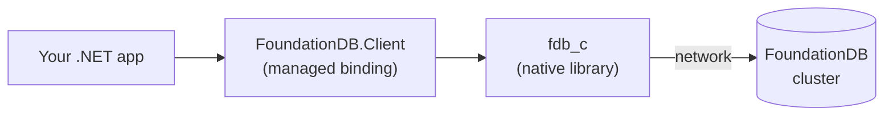

# How it connects

FoundationDB has a client/server split that catches most newcomers. Read these two minutes before you write any code: a version mismatch here makes every operation time out with no useful error.

## Three moving parts



- **`FoundationDB.Client`** is the managed .NET binding: the API you write against. It does not talk to the cluster directly.
- **`fdb_c`** is the native client library it loads, shipped by the `FoundationDB.Client.Native` package. This is what actually speaks the output protocol to the cluster.
- **The cluster** is the running FoundationDB server(s).

## The one rule

The **native `fdb_c` library must be protocol-compatible with the cluster.** A `7.4` native client cannot talk to a `7.3` cluster, and vice versa: FoundationDB's output protocol changes between minor versions.

There are two version knobs, and only one of them is about the cluster:

| Package / setting | What it controls | Rule |
|---|---|---|
| `FoundationDB.Client` (managed) | The API you can call | Use the latest. It does not tie you to a cluster version. |
| `FoundationDB.Client.Native` | The native `fdb_c`, i.e. the output protocol | **Must match your cluster.** `7.3.x` for a `7.3` cluster. |
| API level (`Fdb.Start(730)`, `AddFoundationDb(730, ...)`) | The feature and behaviour level | At or below the cluster's level. `<= 730` for `7.3`; a `7.4+` cluster allows up to `740`. |

So a `7.3` cluster is served by the latest `FoundationDB.Client`, plus `FoundationDB.Client.Native` `7.3.x`, plus API level `730`.

## What a mismatch looks like

The failure is asymmetric, which is what makes it confusing. A matching native client (`fdb_c` `7.3.x` against a `7.3` cluster) connects immediately and every operation succeeds. A mismatched one (`fdb_c` `7.4` against that same `7.3` cluster) still reaches the coordinators, but is rejected as protocol-incompatible, so it never completes the handshake and quietly keeps retrying.

The only thing your code sees is a **transaction timeout**, with nothing pointing at the version. Worse, `fdbcli` uses whatever client you installed system-wide (often a matching one), so it connects fine, which makes it look like your app is broken when the real problem is the native version your app loaded.

To tell them apart, compare the versions. The cluster side:

```console
fdbcli --version
```

The app side: `Fdb.GetClientVersion()` returns the loaded native version and protocol string. If the protocol strings differ, that is your problem.

## Why pin the native client per project

Shipping `fdb_c` through the `FoundationDB.Client.Native` NuGet package, instead of a machine-wide install, means each project locks its own native version. You can keep a `7.3` branch and a `7.4` branch of the same application building and testing side by side, each against its own cluster. A single system-wide client cannot do that.

## Next

- [Cluster setup](cluster-setup.md): connect to an existing cluster and pick the matching native version, or spin one up locally.
