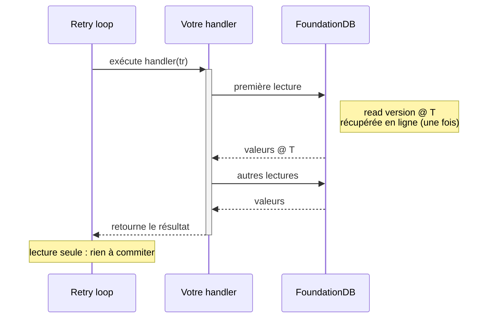
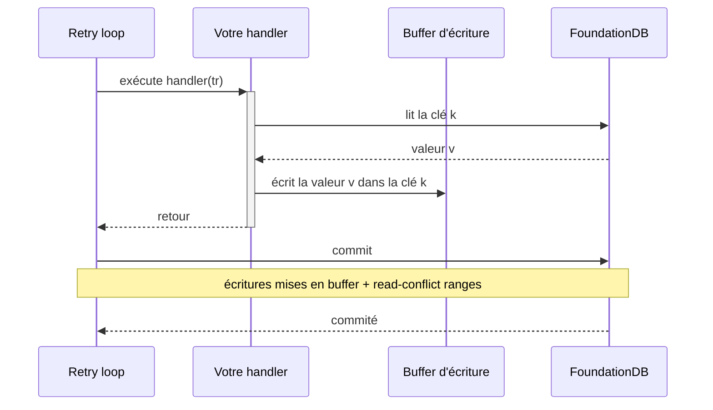
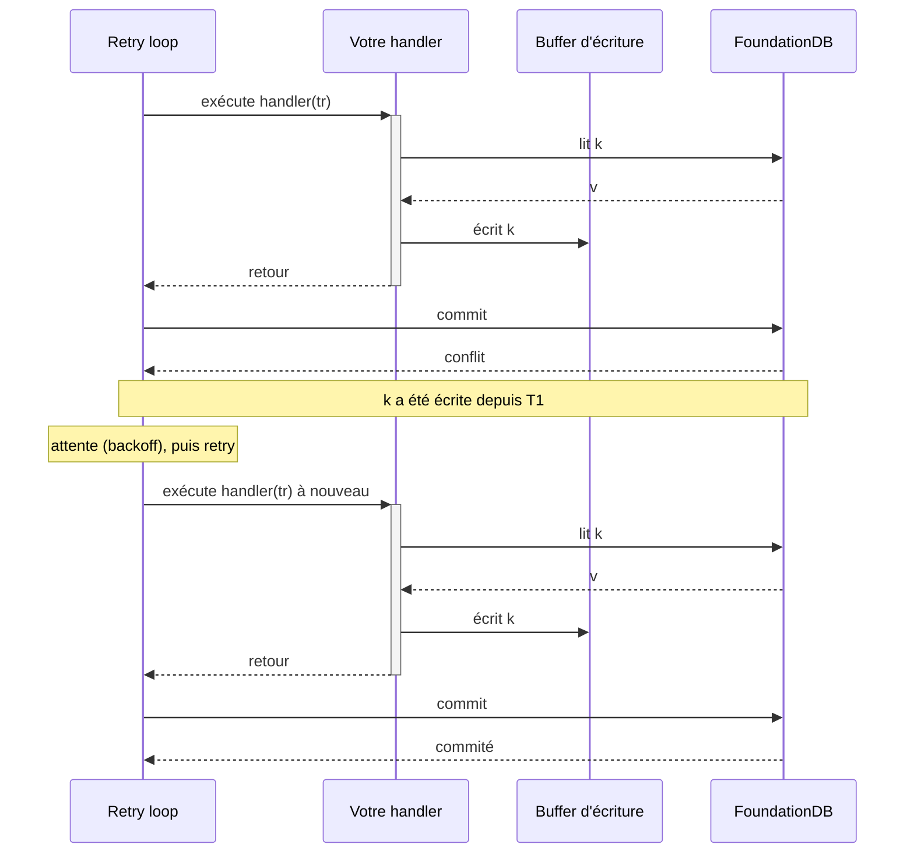

# Transactions : le modèle et ses règles

FoundationDB vous donne des transactions ACID sérialisables sur tout le *keyspace*. Le prix à payer est qu'une transaction peut entrer en conflit et devoir s'exécuter à nouveau, et qu'elle vit sous des limites strictes de temps et de taille. Le *binding* exécute les *retries* pour vous via une *retry loop*, et cette page explique le modèle qui la sous-tend : pourquoi la *retry loop* réexécute votre *handler*, pourquoi ce *handler* doit pouvoir s'exécuter plusieurs fois sans danger, ce qu'est un conflit, et pourquoi les limites existent. Pour les recettes de tâches (exécuter la *retry loop*, les mutations atomiques, les *watches*, paginer une grande *range*), voir le [guide how-to](how-to.md) ; pour l'API transaction de bas niveau, voir la [référence](reference.md).

## La *retry loop*

Une tentative est un échange court et ordonné avec le *cluster* : obtenir une *read version*, lire à cette version, exécuter votre logique, puis commiter les écritures mises en *buffer*. La *retry loop* exécute votre *handler*, et c'est le *handler* qui émet les lectures. Votre logique s'exécute pendant tout le temps où le *handler* est sur la *stack* ; quand il retourne, la *retry loop* envoie le *commit*. Vous n'appelez jamais `CommitAsync` à l'intérieur du *handler*.

Un *handler* en lecture seule (`db.ReadAsync`) lit et retourne un résultat. Il n'y a rien à commiter :



Un *handler* en lecture-écriture (`db.WriteAsync` / `db.ReadWriteAsync`) accumule ses écritures localement au fur et à mesure ; la *retry loop* les envoie en un seul *commit* quand le *handler* retourne :



Si le *commit* entre en conflit (une autre transaction a commité une écriture sur quelque chose que vous avez lu), la *retry loop* attend un court instant et réexécute votre *handler* depuis le début. C'est pourquoi le *handler* doit pouvoir s'exécuter plusieurs fois sans danger :



La *retry loop* réexécute le *handler* sur les erreurs *retryable* jusqu'à ce que le *handler* réussisse, que le `CancellationToken` se déclenche, ou qu'une erreur non-*retryable* soit levée. Une erreur *retryable* est une erreur que le *cluster* s'attend à voir disparaître à la tentative suivante, comme un conflit ou `transaction_too_old` ; la *retry loop* les gère et vous ne les attrapez pas. Une erreur non-*retryable*, ou une exception que vous levez vous-même, annule la transaction sans *commit* et sans *retry*.

## Votre *handler* doit être idempotent

La *retry loop* peut exécuter le *handler* plusieurs fois, donc traitez le *handler* comme une fonction pure de l'état de la base de données. Lors d'un *retry*, les écritures en base de données de la tentative précédente sont abandonnées, mais tout effet de bord que le *handler* a eu sur la mémoire ou le monde extérieur a déjà eu lieu, et se reproduit. Ne mutez jamais d'état externe ou global à l'intérieur du *handler* : pas d'incrémentation d'un compteur en mémoire, d'ajout à un cache, de log indiquant que le travail est fait, ni d'envoi d'un message. Faites ce travail après que la *retry loop* a retourné avec succès.

```csharp
// ❌ FAUX : _cache est muté même sur des tentatives qui ne commitent jamais
await db.WriteAsync(tr =>
{
    tr.Set(k, v);
    _cache[id] = book;   // mute l'état à l'intérieur du handler
}, ct);

// ✅ CORRECT : ne toucher à l'état externe qu'après un commit réussi
await db.WriteAsync(tr => tr.Set(k, v), ct);
_cache[id] = book;       // mute l'état à l'extérieur du handler
```

Les écritures en base de données peuvent être répétées sans danger, car seule la dernière tentative, celle qui a été commitée, survit. Les effets externes, eux, ne le peuvent pas, et c'est pourquoi ils doivent venir après la *retry loop*.

## Les conflits et le *resolver*

Une transaction en lecture-écriture entre en conflit quand une autre transaction commite une écriture sur une clé que cette transaction a lue, dans la fenêtre entre sa *read version* et son *commit*. Au moment du *commit*, le *resolver* du *cluster* compare le *read set* de la transaction à toutes les écritures commitées dans cette fenêtre. Un chevauchement signifie que la transaction a lu une valeur qui n'est plus à jour, donc le *commit* est rejeté et la *retry loop* réessaie. La *retry loop* masque chaque *retry*, mais un conflit coûte quand même un aller-retour complet, donc un design qui entre souvent en conflit est lent même s'il reste correct. Pour savoir comment le *resolver* fait cela au niveau physique, voir [comment le *cluster* traite une transaction](../advanced-layers/index.md).

Deux techniques évitent les conflits au lieu de les payer, et les deux fonctionnent en gardant des clés hors du *read set* :

- **Les mutations atomiques** modifient une valeur sans la lire, donc elles ne créent aucun *read-conflict* et n'entrent jamais en conflit entre elles. Un compteur écrit avec `AtomicAdd64` ne fait jamais de *retry* en cas de contention.
- **Les lectures *snapshot*** (`tr.Snapshot.GetAsync` / `tr.Snapshot.GetRange`) retournent une valeur sans ajouter la clé au *read set*, donc une écriture ultérieure sur cette clé ne fait pas entrer cette transaction en conflit. Utilisez-les quand une lecture légèrement périmée est acceptable, comme compter des *shards* ou rassembler des statistiques.

Le [guide how-to](how-to.md#increment-a-counter-with-atomic-mutations) donne le code pour les deux.

## Les limites, et pourquoi elles existent

Chaque transaction vit sous quatre limites strictes :

| Limite | Valeur | Conséquence |
|---|---|---|
| Durée de vie de la transaction | **5 secondes** | les lectures/scans longs échouent avec `transaction_too_old` (1007) |
| Taille d'une valeur | **100 000 octets** | répartir les gros blobs sur plusieurs clés |
| Taille d'une clé | **10 000 octets** | garder des clés tuple raisonnables |
| Écritures par transaction | **10 000 000 octets** | découper les gros imports sur plusieurs transactions |

Les limites ne sont pas des boutons de réglage : elles découlent de la façon dont le *cluster* traite une transaction. Une transaction lit à une seule version fixe, et le *cluster* garde les données nécessaires pour servir cette version pendant une fenêtre bornée de cinq secondes. Une lecture après cette fenêtre ne peut plus être servie de façon cohérente, donc elle échoue avec `transaction_too_old` (1007). Les limites de taille bornent le travail d'un seul *commit* et de la vérification de conflit que le *resolver* effectue dessus, de sorte qu'une seule transaction ne peut pas épuiser le *cluster*. À cause de la borne des cinq secondes, un *range scan* potentiellement grand est paginé sur plusieurs transactions au lieu d'être exécuté comme une seule longue lecture, et un import en masse est découpé sur plusieurs transactions ; le [guide how-to](how-to.md#page-a-large-range-across-transactions) montre les deux. Le [modèle du *cluster*](../advanced-layers/index.md) explique la fenêtre de version en détail.

## Où aller ensuite

Si vous construisez un *Layer* d'accès aux données, [Clés, valeurs et *Layers*](../keys-and-layers/index.md) explique comment un *Layer* résout son état à l'intérieur d'une transaction, de sorte que plusieurs *Layers* commitent ensemble ou pas du tout. Pour savoir comment le *cluster* traite tout cela et comment le rendre rapide, continuez avec [Layers avancés](../advanced-layers/index.md).
