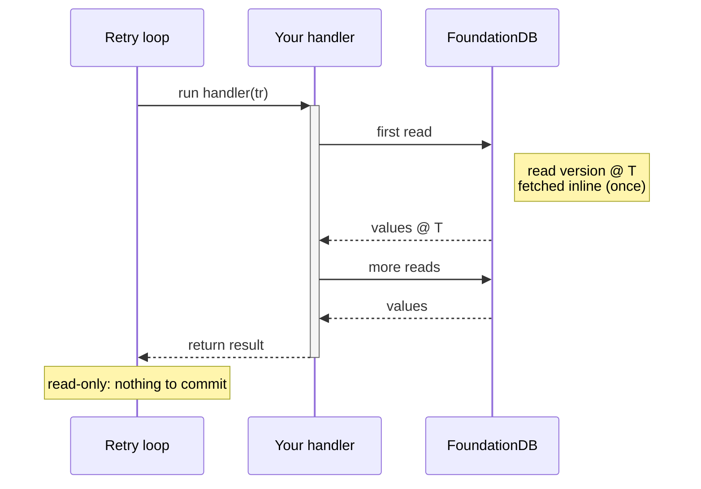
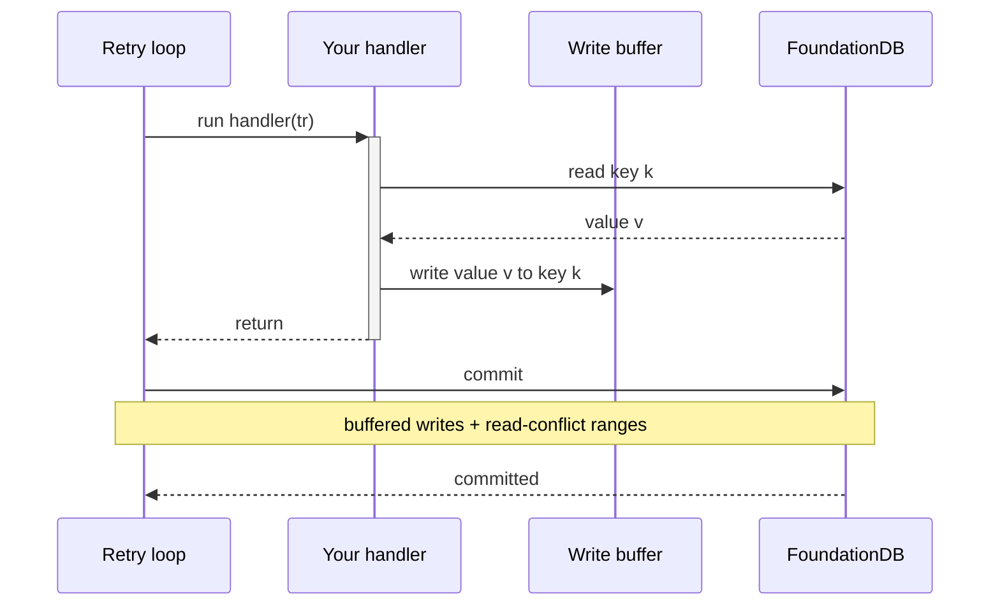
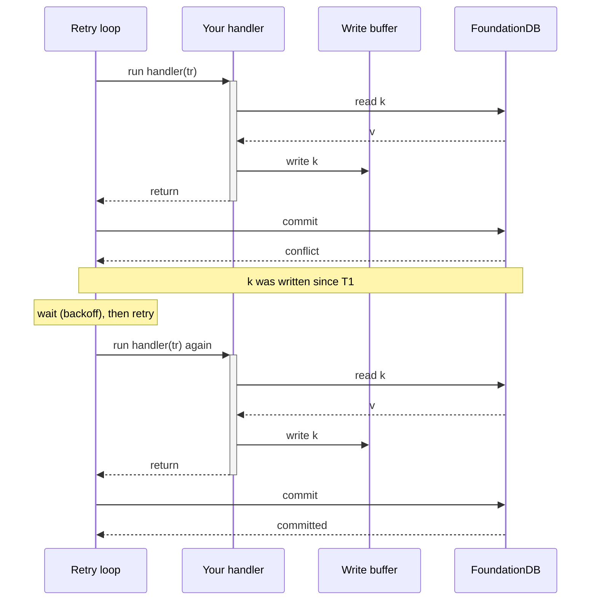

# Transactions: the model and its rules

FoundationDB gives you serializable, ACID transactions over the whole keyspace. The cost is that a transaction may conflict and need to run again, and that it lives under hard limits on time and size. The binding runs the retries for you through a retry loop, and this page explains the model behind it: why the loop re-runs your handler, why that handler must be safe to run more than once, what a conflict is, and why the limits exist. For the task recipes (running the loop, atomic mutations, watches, paging a large range) see the [how-to guide](how-to.md); for the low-level transaction API see the [reference](reference.md).

## The retry loop

One attempt is a short, ordered exchange with the cluster: get a read version, read at that version, run your logic, then commit any buffered writes. The retry loop runs your handler, and the handler is what issues the reads. Your logic runs the whole time the handler is on the stack; when it returns, the loop commits. You never call `CommitAsync` inside the handler.

A read-only handler (`db.ReadAsync`) reads and returns a result. There is nothing to commit:



A read-write handler (`db.WriteAsync` / `db.ReadWriteAsync`) buffers its writes locally as it runs; the loop sends them in one commit when the handler returns:



If the commit conflicts (another transaction committed a write to something you read), the loop waits briefly and runs your handler again from the top. That is why the handler must be safe to run more than once:



The loop re-runs the handler on retryable errors until the handler succeeds, the `CancellationToken` fires, or a non-retryable error is thrown. A retryable error is one the cluster expects to clear on the next attempt, such as a conflict or `transaction_too_old`; the loop handles those and you do not catch them. A non-retryable error, or an exception you throw yourself, aborts the transaction with no commit and no retry.

## Your handler must be idempotent

The loop can run the handler more than once, so treat the handler as a pure function of database state. On a retry the earlier attempt's database writes are discarded, but any side effect the handler had on memory or the outside world already happened, and happens again. Never mutate external or global state inside the handler: no incrementing an in-memory counter, adding to a cache, logging that the work is done, or sending a message. Do that work after the loop returns successfully.

```csharp
// ❌ WRONG: _cache is mutated even on attempts that never commit
await db.WriteAsync(tr =>
{
    tr.Set(k, v);
    _cache[id] = book;   // mutates state inside the handler
}, ct);

// ✅ RIGHT: touch external state only after a successful commit
await db.WriteAsync(tr => tr.Set(k, v), ct);
_cache[id] = book;       // mutates state outside the handler
```

The database writes are safe to repeat because only the last, committed attempt survives. The external effects are not, which is why they belong after the loop.

## Conflicts and the resolver

A read-write transaction conflicts when another transaction commits a write to a key this transaction read, in the window between its read version and its commit. At commit time the cluster's resolver checks the transaction's read set against every write committed in that window. An overlap means the transaction read a value that is no longer current, so the commit is rejected and the loop retries. The retry loop hides each retry, but a conflict still costs a full round-trip, so a design that conflicts often is slow even while it stays correct. For how the resolver does this at the physical level, see [how the cluster processes a transaction](../advanced-layers/index.md).

Two techniques avoid conflicts instead of paying for them, and both work by keeping keys out of the read set:

- **Atomic mutations** change a value without reading it, so they create no read-conflict and never conflict with each other. A counter written with `AtomicAdd64` never retries on contention.
- **Snapshot reads** (`tr.Snapshot.GetAsync` / `tr.Snapshot.GetRange`) return a value without adding the key to the read set, so a later write to that key does not make this transaction conflict. Use them when a slightly stale read is acceptable, such as counting shards or gathering statistics.

The [how-to guide](how-to.md#increment-a-counter-with-atomic-mutations) gives the code for both.

## The limits, and why they exist

Every transaction lives under four hard limits:

| Limit | Value | Consequence |
|---|---|---|
| Transaction lifetime | **5 seconds** | long reads/scans fail with `transaction_too_old` (1007) |
| Value size | **100,000 bytes** | split large blobs across keys |
| Key size | **10,000 bytes** | keep tuple keys reasonable |
| Writes per transaction | **10,000,000 bytes** | batch large imports across transactions |

The limits are not tuning knobs; they follow from how the cluster processes a transaction. A transaction reads at one fixed version, and the cluster keeps the data needed to serve that version for a bounded window of five seconds. A read after that window can no longer be served consistently, so it fails with `transaction_too_old` (1007). The size limits bound the work of a single commit and of the conflict check the resolver runs over it, so one transaction cannot exhaust the cluster. Because of the five-second bound, a range scan that might be large is paged across transactions rather than run as one long read, and a bulk import is batched across transactions; the [how-to guide](how-to.md#page-a-large-range-across-transactions) shows both. The [cluster model](../advanced-layers/index.md) explains the version window in full.

## Where to go from here

If you are building a data-access Layer, [Keys, Values & Layers](../keys-and-layers/index.md) covers how a Layer resolves its state inside a transaction, so several layers commit together or not at all. For how the cluster processes all of this and how to make it fast, continue to [Advanced Layers](../advanced-layers/index.md).
