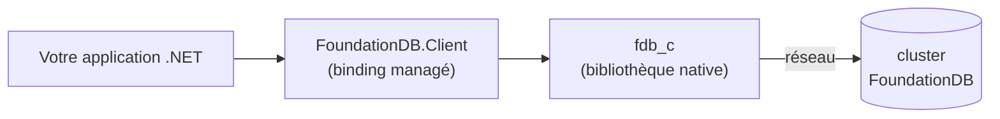

# Fonctionnement

FoundationDB a une séparation client/serveur qui piège la plupart des nouveaux venus. Prenez deux minutes pour lire ceci avant d'écrire la moindre ligne de code : une incompatibilité de version ici provoque un *timeout* sur chaque opération, sans erreur utile.

## Les trois composants



- **`FoundationDB.Client`** est le *binding* .NET managé : l'API contre laquelle vous écrivez. Il ne parle pas directement au *cluster*.
- **`fdb_c`** est la bibliothèque cliente native qu'il charge, livrée par le *package* `FoundationDB.Client.Native`. C'est elle qui parle réellement le *wire protocol* au *cluster*.
- **Le *cluster*** est le ou les serveurs FoundationDB en cours d'exécution.

## La règle unique

La **bibliothèque native `fdb_c` doit être compatible au niveau protocole avec le *cluster*.** Un client natif `7.4` ne peut pas parler à un *cluster* `7.3`, et inversement : le *wire protocol* de FoundationDB change entre versions mineures.

Il y a deux réglages de version, et un seul concerne le *cluster* :

| Package / réglage | Ce qu'il contrôle | Règle |
|---|---|---|
| `FoundationDB.Client` (managé) | L'API que vous pouvez appeler | Prenez la dernière. Elle ne vous lie pas à une version de *cluster*. |
| `FoundationDB.Client.Native` | Le `fdb_c` natif, c'est-à-dire le *wire protocol* | **Doit correspondre à votre *cluster*.** `7.3.x` pour un *cluster* `7.3`. |
| Niveau d'API (`Fdb.Start(730)`, `AddFoundationDb(730, ...)`) | Le niveau de fonctionnalités et de comportement | Au niveau du *cluster* ou en dessous. `<= 730` pour `7.3` ; un *cluster* `7.4+` autorise jusqu'à `740`. |

Donc un *cluster* `7.3` est servi par le dernier `FoundationDB.Client`, plus `FoundationDB.Client.Native` `7.3.x`, plus le niveau d'API `730`.

## À quoi ressemble une incompatibilité

L'échec est asymétrique, et c'est ce qui le rend déroutant. Un client natif compatible (`fdb_c` `7.3.x` face à un *cluster* `7.3`) se connecte immédiatement et chaque opération réussit. Un client incompatible (`fdb_c` `7.4` face à ce même *cluster* `7.3`) atteint quand même les coordinateurs, mais il est rejeté comme incompatible au niveau protocole, donc il ne termine jamais le *handshake* et continue silencieusement ses *retry*.

La seule chose que votre code voit est un **_timeout_ de transaction**, sans rien qui pointe vers la version. Pire, `fdbcli` utilise le client que vous avez installé au niveau du système (souvent un client compatible), donc il se connecte sans problème, ce qui laisse croire que votre application est cassée alors que le vrai problème est la version native que votre application a chargée.

Pour les distinguer, comparez les versions. Côté *cluster* :

```console
fdbcli --version
```

Côté application : `Fdb.GetClientVersion()` renvoie la version native chargée et la chaîne de protocole. Si les chaînes de protocole diffèrent, c'est là votre problème.

## Pourquoi épingler le client natif par projet

Livrer `fdb_c` via le *package* NuGet `FoundationDB.Client.Native`, plutôt qu'une installation à l'échelle de la machine, fait que chaque projet verrouille sa propre version native. Vous pouvez garder une branche `7.3` et une branche `7.4` de la même application dont le *build* et les tests tournent côte à côte, chacune contre son propre *cluster*. Un client unique installé au niveau du système ne peut pas faire ça.

## Étape suivante

- [Installer un cluster](cluster-setup.md) : connectez-vous à un *cluster* existant et choisissez la version native correspondante, ou lancez-en un en local.
