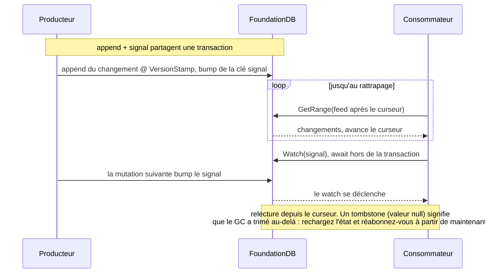

# *Layers* avancés

Ce guide sert à construire des *layers* sophistiqués : du code sensible à la performance, et des *patterns* distribués qui s'étendent sur plusieurs nœuds (*change feeds*, *pub/sub*, vues observables). Il suppose [Clés, valeurs et *Layers*](../keys-and-layers/index.md) et [Transactions](../transactions/index.md).

Chaque conception ici découle d'une seule chose : la façon dont le *cluster* traite réellement une transaction. Ce modèle, les rôles, le flux de transaction, la fenêtre de 5 secondes et l'horloge globale, fait [l'objet de sa propre page](index.md) ; lisez-la d'abord, car les règles ci-dessous en sont les conséquences directes.

## Performance : minimiser les *round-trips*

Le client natif **met en pipeline** les requêtes concurrentes, donc l'ennemi de la latence est une **dépendance de données séquentielle** : lire une clé, examiner le résultat, et seulement ensuite lancer la lecture suivante. Chaque saut de ce genre est un *round-trip* complet entre le client et le *cluster*, impossible à masquer.

```csharp
// ❌ N round-trips : chaque await bloque sur le précédent
foreach (var id in ids) results.Add(await tr.GetAsync(subspace.Key(id)));

// ✅ une seule multi-lecture groupée
Slice[] values = await tr.GetValuesAsync(ids.Select(id => subspace.Key(id)));

// ✅ ou lancer des lectures indépendantes en concurrence pour qu'elles soient mises en pipeline en ~un seul round-trip
Slice[] vs = await Task.WhenAll(tr.GetAsync(k1), tr.GetAsync(k2), tr.GetAsync(k3));
```

`tr.GetValuesAsync(keys)` lit plusieurs clés indépendantes en un seul lot (c'est exactement ce que fait le « fetch these metadata keys » d'un *store* de documents). Pour les *ranges*, `GetRangeAsync(range, options)` renvoie une page par *round-trip*. Réglez `FdbRangeOptions` (`WantAll`, `WithLimit`, le mode *streaming*) selon le *pattern* d'accès.

L'habitude la plus utile est de **réduire les dépendances « lire → décider → lire ».** Si vous lisez la clé A seulement pour décider s'il faut lire B, ou comment, demandez-vous si l'information peut être *encodée* pour qu'une seule lecture la porte. (Le *change feed* ci-dessous fait exactement ça : plutôt que « lire un marqueur de *trim*, puis lire le *feed* par *range* », le signal de *trim* est un *tombstone* *à l'intérieur* du *feed*, donc un seul `GetRange` renvoie à la fois les données et le signal.) Quand c'est vraiment impossible, lancez les deux en parallèle avec `Task.WhenAll` et jetez la lecture inutile dans le rare cas où ça arrive.

Autres leviers : le GRV a un coût réel (*sequencer* + quorum de *proxies*, soumis à un *rate-limit*), donc ne découpez pas le travail en petites transactions inutiles ; utilisez des lectures *snapshot* là où une lecture légèrement périmée convient ; gardez les clés et les valeurs petites ; préférez des ids internes compacts plutôt que de répéter de longues clés.

## Forte contention

Comme les conflits sont tranchés au niveau des *resolvers* sur les *read-conflict ranges*, une clé que beaucoup de transactions lisent puis écrivent devient un *hotspot*. Évitez-le avec des **mutations atomiques** (pas de lecture, pas de conflit), des **lectures *snapshot*** (pas de *read-conflict*), et du **sharding** des clés à forte écriture sur plusieurs sous-clés que vous agrégez à la lecture. Un unique compteur global est un goulet d'étranglement garanti ; `FdbHighContentionCounter` montre l'alternative par *sharding*.

## Synthèse : construire un *change feed*

Un *change feed* permet à d'autres nœuds d'observer un flux de changements et de maintenir en mémoire une vue de l'état distant. Il compose toutes les primitives ci-dessus. Une implémentation complète, vérifiée à la compilation, se trouve dans [`samples/SkillValidation/BookStore.ChangeFeed.cs`](../../../samples/SkillValidation/BookStore.ChangeFeed.cs).

Tout le protocole est une seule boucle en régime permanent, avec un contrôle de *fencing* qui transforme un *range* manqué en resynchronisation propre au lieu d'une perte de données silencieuse :



**1. *Append* et signal, dans la transaction de la mutation elle-même.** Chaque mutation ajoute un changement sous un `VersionStamp` ordonné par le commit et incrémente une clé signal surveillée, le tout dans la même transaction que l'écriture des données, si bien que le *feed* ne peut jamais être en désaccord avec les données :

```csharp
var stamp = tr.CreateUniqueVersionStamp();
tr.SetVersionStampedKey(subspace.Key(SUBSPACE_FEED, stamp), FdbValue.ToJson(change));
tr.AtomicIncrement64(subspace.Key(SUBSPACE_SIGNAL));   // réveille chaque abonné ; sans conflit
```

**2. S'abonner par *streaming* depuis un curseur.** Le consommateur lit des pages de changements après son curseur ; une fois à jour, il pose un *watch* sur la clé signal, attend ce *watch* hors de la transaction, puis relit. Le `VersionStamp` de la dernière entrée est le curseur de reprise. Exposez ça comme un `IAsyncEnumerable<T>` et enveloppez-le d'une fine couche : un `Channel<T>` ou un *callback*.

**3. Rétention, avec une détection de vivacité qui ne compare pas d'horloges.** Un *log version-stamped* grandit indéfiniment, donc un GC doit le *trimmer*, mais jamais au-delà de ce qu'a consommé chaque abonné *vivant*. « Vivant » se décide sans comparer d'horloges : chaque abonné renouvelle un *token* issu de la base de données sur un intervalle local ; un observateur lit ces *tokens* sur *son propre* intervalle local et évince un abonné dont le *token* n'a pas **changé** sur plusieurs sondages. (« Inchangé pendant N sondages » ≈ « N × le délai local propre à l'observateur » : un test d'égalité plus une mesure locale de temps écoulé, jamais une comparaison d'horodatage entre nœuds.) Les lectures de l'observateur ne sont pas des lectures *snapshot*, donc un abonné qui renouvelle en même temps entre en conflit avec le GC et est épargné.

**4. *Fencing* : détecter « j'ai pris du retard » en un seul *round-trip*.** Un abonné figé assez longtemps est évincé et le GC récupère l'espace au-delà de son curseur. Il a maintenant *manqué des changements* et sa vue n'est plus fiable. Il faut le lui dire. Le signal efficace est un **tombstone** : quand le GC récupère l'espace jusqu'à un horizon, il laisse une seule entrée à valeur vide au *versionstamp* de cet horizon. Un abonné qui reprend et dont le curseur est plus ancien que l'horizon lit ce *tombstone* en *premier* dans sa lecture de *range* normale : une valeur vide se désérialise en `null` (un vrai changement est toujours non-null), donc c'est détecté **sans lecture supplémentaire**. L'abonné *throw* une exception typée `ChangeFeedOutOfSyncException`, que le consommateur attrape pour **recharger l'état courant et se réabonner à partir de « maintenant »**.

C'est le même contrat que l'`OffsetOutOfRange` de Kafka ou le `TrimmedDataAccessException` de DynamoDB Streams : vous ne pouvez pas *empêcher* un consommateur trop lent de manquer des données, mais vous pouvez le détecter proprement et forcer une resynchronisation.

## Une *checklist* de revue pour les *layers* distribués

- Pas de chaînes séquentielles *lire → décider → lire* sur le *hot path* : groupées, parallèles, ou encodées en une seule lecture ?
- Lectures indépendantes lancées en concurrence, jamais `await` dans une boucle ?
- Clés à forte écriture réparties par *sharding* ou en mutations atomiques ; lectures *snapshot* là où la sérialisation n'est pas nécessaire ?
- Longs *scans* paginés sur plusieurs transactions ; grandes valeurs découpées en *chunks* ; le *bulk* via `Fdb.Bulk.*` ?
- Le temps entre nœuds utilise l'horloge de la base de données (*read version* / *versionstamp*), jamais les horloges murales locales ?
- Vivacité via la détection de changement de *token* plus le temps écoulé local entre sondages, pas un calcul version-vers-durée ?
- *Logs*/*feeds* non bornés dotés d'un chemin de rétention, et les consommateurs peuvent détecter un trou et se resynchroniser ?
- *Handlers* de transaction toujours idempotents ; le `State` résolu du *layer* confiné à la transaction ?
