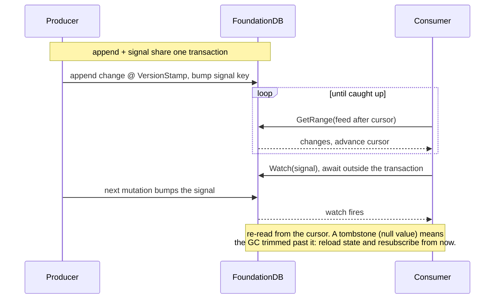

# Advanced Layers

This guide is for building *sophisticated* layers: performance-sensitive code, and distributed patterns that span multiple nodes (change feeds, pub/sub, observable views). It assumes [Keys, Values & Layers](../keys-and-layers/index.md) and [Transactions](../transactions/index.md).

Every design here falls out of one thing: how the cluster actually processes a transaction. That model, the roles, the transaction flow, the 5-second window, and the global clock, is [its own page](index.md); read it first, because the rules below are its direct consequences.

## Performance: minimize round-trips

The native client **pipelines** concurrent requests, so the enemy of latency is a **serial data dependency**: reading a key, inspecting the result, and only then issuing the next read. Each such hop is a full client↔cluster round-trip that cannot be hidden.

```csharp
// ❌ N round-trips: each await blocks on the previous
foreach (var id in ids) results.Add(await tr.GetAsync(subspace.Key(id)));

// ✅ one batched multi-read
Slice[] values = await tr.GetValuesAsync(ids.Select(id => subspace.Key(id)));

// ✅ or issue independent reads concurrently so they pipeline into ~one round-trip
Slice[] vs = await Task.WhenAll(tr.GetAsync(k1), tr.GetAsync(k2), tr.GetAsync(k3));
```

`tr.GetValuesAsync(keys)` reads many independent keys in one batch (it's exactly what a document store's "fetch these metadata keys" does). For ranges, `GetRangeAsync(range, options)` returns a page per round-trip. Tune `FdbRangeOptions` (`WantAll`, `WithLimit`, streaming mode) to the access pattern.

The most valuable habit is to **collapse "read → decide → read" dependencies.** If you read key A only to decide whether/how to read B, ask whether the information can be *encoded* so a single read carries it. (The change feed below does exactly this: rather than "read a trim marker, then range-read the feed," the trim signal is a tombstone *inside* the feed, so one `GetRange` returns both the data and the signal.) When you genuinely can't, issue both in parallel with `Task.WhenAll` and discard the wasted one in the rare case.

Other levers: GRV has a real cost (sequencer + proxy quorum, rate-limited), so don't split work into needless tiny transactions; use snapshot reads where staleness is fine; keep keys and values small; prefer compact internal ids over repeating long keys.

## High contention

Because conflicts are decided at the resolvers on read-conflict ranges, a key that many transactions read-then-write becomes a hotspot. Avoid it with **atomic mutations** (no read, no conflict), **snapshot reads** (no read-conflict), and **sharding** of write-hot keys across many sub-keys that you aggregate on read. A single global counter is a guaranteed bottleneck; `FdbHighContentionCounter` shows the sharded alternative.

## Capstone: building a change feed

A change feed lets other nodes observe a stream of changes and maintain an in-memory view of remote state. It composes every primitive above. A full, compile-checked implementation lives in [`samples/SkillValidation/BookStore.ChangeFeed.cs`](../../../samples/SkillValidation/BookStore.ChangeFeed.cs).

The whole protocol is one steady-state loop, with a fencing check that turns a missed range into a clean resync instead of silent data loss:



**1. Append and signal, in the mutation's own transaction.** Every mutation appends a change under a commit-ordered `VersionStamp` and bumps one watched signal key, all in the same transaction as the data write, so the feed can never disagree with the data:

```csharp
var stamp = tr.CreateUniqueVersionStamp();
tr.SetVersionStampedKey(subspace.Key(SUBSPACE_FEED, stamp), FdbValue.ToJson(change));
tr.AtomicIncrement64(subspace.Key(SUBSPACE_SIGNAL));   // wake every subscriber; conflict-free
```

**2. Subscribe by streaming from a cursor.** The consumer reads pages of changes after its cursor; when caught up, it watches the signal key, awaits the watch outside the transaction, then re-reads. The `VersionStamp` of the last entry is the resume cursor. Expose this as an `IAsyncEnumerable<T>` and wrap it thinly as a `Channel<T>` or a callback.

**3. Retention, with liveness that doesn't compare clocks.** A version-stamped log grows forever, so a GC must trim it, but only up to what every *live* subscriber has consumed. "Live" is decided without comparing clocks: each subscriber renews a database-sourced token on a local interval; an observer reads those tokens on *its own* local interval and evicts a subscriber whose token hasn't **changed** across several polls. ("Unchanged for N polls" ≈ "N × the observer's own local delay": an equality check plus a local elapsed-time measurement, never a cross-node timestamp comparison.) The observer's reads are non-snapshot, so a subscriber that renews concurrently conflicts the GC and is spared.

**4. Fencing: detecting "I fell behind" in one round-trip.** A subscriber frozen long enough is evicted and the GC reclaims past its cursor. It has now *missed changes* and its view is untrustworthy. It must be told. The efficient signal is a **tombstone**: when the GC reclaims up to a horizon, it leaves a single empty-value entry at the horizon's versionstamp. A resuming subscriber whose cursor is older than the horizon reads that tombstone *first* in its normal range read: an empty value deserializes to `null` (a real change is always non-null), so it's detected with **no extra read**. The subscriber throws a typed `ChangeFeedOutOfSyncException`, which the consumer catches to **reload current state and re-subscribe from "now."**

This is the same contract as Kafka's `OffsetOutOfRange` or DynamoDB Streams' `TrimmedDataAccessException`: you cannot *prevent* a too-slow consumer from missing data, but you can detect it cleanly and force a resync.

## A review checklist for distributed layers

- No serial *read → decide → read* chains on the hot path: batched, parallel, or encoded into one read?
- Independent reads issued concurrently, never `await`-ed in a loop?
- Write-hot keys sharded or using atomics; snapshot reads where serialization isn't needed?
- Long scans paged across transactions; large values chunked; bulk via `Fdb.Bulk.*`?
- Cross-node time uses the database clock (read version / versionstamp), never local wall clocks?
- Liveness via token change-detection plus local inter-poll elapsed time, not version-to-duration math?
- Unbounded logs/feeds have a retention path, and consumers can detect a gap and resync?
- Transaction handlers still idempotent; resolved layer `State` confined to the transaction?
