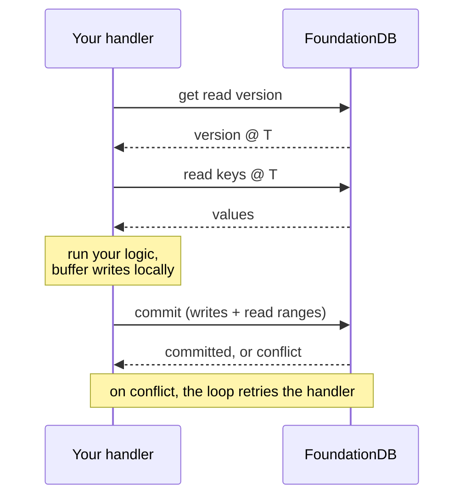

# Transactions

FoundationDB gives you serializable, ACID transactions over the whole keyspace. The catch is that a transaction may **conflict** and need to be retried, and it has hard limits on time and size. This binding handles the retries for you through a **retry loop**, but only if you use it correctly. This guide covers that loop and the behaviors you must design around.

> This is the companion to the lower-level [Transaction Basics](../Transaction_Basics.md) page. If you're building a data-access *Layer*, read [Keys, Values & Layers](keys-and-layers.md) too.

## Always use the retry loop

Don't manually `BeginTransaction` / `CommitAsync` in application code. Use the retryable methods on `IFdbDatabase` (or `IFdbDatabaseProvider`), and pick the narrowest one:

| Method | Transaction | Use for |
|---|---|---|
| `db.ReadAsync(handler, ct)` | `IFdbReadOnlyTransaction` | reads only; returns a result |
| `db.WriteAsync(handler, ct)` | `IFdbTransaction` | mutations that return **nothing** (the handler may still read) |
| `db.ReadWriteAsync(handler, ct)` | `IFdbTransaction` | mutations that must **return a value** |

```csharp
// READ
Book? book = await db.ReadAsync(async tr =>
{
    var bytes = await tr.GetAsync(subspace.Key("D", id));
    return CrystalJson.Deserialize<Book>(bytes);   // empty/missing -> null
}, ct);

// WRITE (nothing to return)
await db.WriteAsync(tr => tr.Set(subspace.Key("D", book.Id), FdbValue.ToJson(book)), ct);

// READ-MODIFY-WRITE (need a result)
long balance = await db.ReadWriteAsync(async tr =>
{
    long current = (await tr.GetAsync(accountKey)).ToInt64();
    long updated = current + amount;
    tr.Set(accountKey, FdbValue.ToFixed64LittleEndian(updated));
    return updated;
}, ct);
```

The loop **commits for you** (never call `CommitAsync` inside the handler) and re-runs the handler on retryable errors until it succeeds, the `CancellationToken` fires, or a non-retryable error is thrown. The split between `WriteAsync` and `ReadWriteAsync` is about whether you return a value, not about whether you read. Both hand you a full read/write transaction; `ReadWriteAsync` has no "returns nothing" overload.

One attempt is a short, ordered exchange with the cluster: get a read version, read at that version, run your logic, then commit. If the commit conflicts, the loop runs your handler again from the top.



## The one rule: your handler must be idempotent

> The handler can and will run more than once. Treat it as a pure function of database state.

Never mutate external or global state inside the handler: no incrementing in-memory counters, adding to caches, logging "done", or sending messages. On a retry, those side effects happen again, but the earlier attempt's database writes were discarded. Do all such work **after** the loop returns successfully:

```csharp
// ❌ WRONG: _cache is mutated even on attempts that never commit
await db.WriteAsync(tr => { tr.Set(k, v); _cache[id] = book; }, ct);

// ✅ RIGHT: touch external state only after a successful commit
await db.WriteAsync(tr => tr.Set(k, v), ct);
_cache[id] = book;
```

## Hard limits

| Limit | Value | Consequence |
|---|---|---|
| Transaction lifetime | **5 seconds** | long reads/scans fail with `transaction_too_old` (1007) |
| Value size | **100,000 bytes** | split large blobs across keys |
| Key size | **10,000 bytes** | keep tuple keys reasonable |
| Writes per transaction | **10,000,000 bytes** | batch large imports across transactions |

A range scan that might be large must be **paged across transactions** (resume from the last key's `Successor()`), not run as one long read. For bulk import/export, use the `Fdb.Bulk.*` helpers, which manage batching and the time window for you.

## Conflicts, and how to avoid them

A read-write transaction conflicts if another transaction commits a write to a key this transaction **read**, between its read version and its commit. The retry loop hides the retry, but conflicts cost latency. To reduce them:

- **Use atomic mutations instead of read-modify-write** where you can. They don't read, so they create no read-conflict and never conflict with each other:
  ```csharp
  tr.AtomicAdd64(counterKey, +1);            // value stored as fixed little-endian 64-bit
  tr.AtomicIncrement64(counterKey);
  tr.AtomicDecrement64(counterKey, clearIfZero: true);
  tr.AtomicMax(key, v); tr.AtomicMin(key, v); tr.AtomicAnd/Or/Xor(key, mask);
  ```
- **Snapshot reads** (`tr.Snapshot.GetAsync/GetRange`) read without creating a read-conflict on those keys. Use them when a slightly stale read is acceptable (counting shards, statistics).
- **Shard write-hot keys** across N sub-keys and aggregate on read: a single frequently-written key serializes all writers (see `FdbHighContentionCounter`).

## Watches: reacting to changes without polling

`tr.Watch(key, ct)` returns an `FdbWatch` that completes when the key's value changes after the transaction commits. Create it inside a transaction and `await` it **outside**:

```csharp
FdbWatch watch = await db.ReadWriteAsync(async tr => tr.Watch(signalKey, ct), ct);
await watch;   // resolves when signalKey changes
```

- Pass an **application/outer** `CancellationToken` to `Watch`, **not** `tr.Cancellation`: the watch outlives the transaction.
- A watch only **notifies** that the key changed; it does not deliver the new value. When it fires, re-read.
- Watches are limited per database, so use them for low-frequency signals, not high-throughput streaming.

The canonical use is a **signal-key fan-out**: a producer bumps a single watched key with `AtomicIncrement` in the same transaction as its data write; consumers watch that key and re-read when it fires. This is the backbone of pub/sub and change feeds (see [Advanced Layers](advanced-layers.md)).

## Layers inside transactions

A Layer resolves its per-transaction `State` inside the handler and uses it there. The payoff is **composing layers in one transaction**, so everything commits together or not at all:

```csharp
await db.WriteAsync(async tr =>
{
    var books   = await bookStore.Resolve(tr);
    var counter = await statsCounter.Resolve(tr);
    books.Insert(tr, book);
    counter.Add(tr, 1);          // both commit atomically, or neither does
}, ct);
```

When `Resolve` needs an argument (most commonly a tenant), implement `IFdbLayer<TState, TOptions>`, whose `Resolve(tr, options)` and retry-loop helpers take that argument.

## Errors

`FdbException` carries an `FdbError` code. Retryable codes (conflicts, `transaction_too_old`, …) are handled by the loop, so don't catch them inside the handler. Throwing your *own* exception out of the handler aborts the transaction and propagates (no commit, no retry); use that for genuine application errors.

Next: **[Advanced Layers](advanced-layers.md)**, how the cluster processes all this, and how to make it fast.
